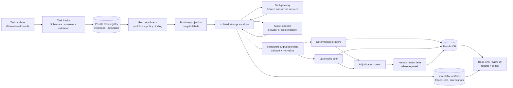
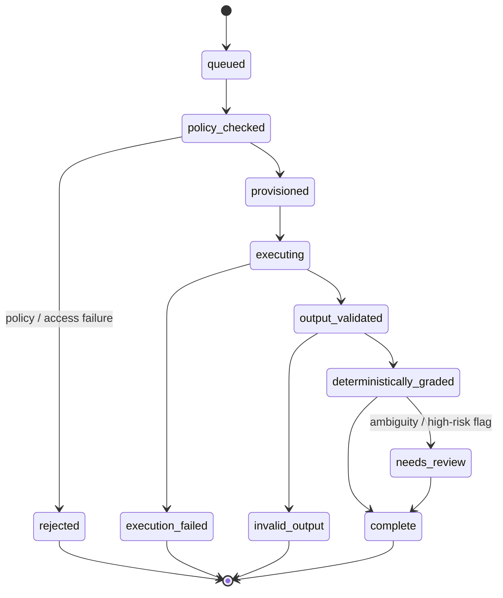
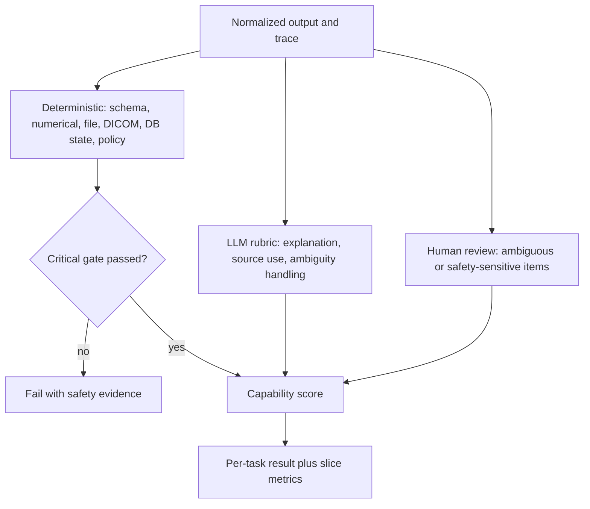

# Architecture: MedPhys-AgentBench

## 1. Design target

MedPhys-AgentBench should be a **research evaluation platform**, not a clinical
automation product. Its target claim is deliberately narrow:

> Under a declared task, tool, policy, and model configuration, this agent
> achieved (or did not achieve) a reproducible, safe, reviewable outcome.

That is a stronger claim than an exam-score leaderboard and a much weaker claim
than clinical competence or readiness for autonomous care. The system must not
connect to live PACS, TPS, OIS, scanners, treatment-delivery systems, or EHRs.
All initial task environments are synthetic, de-identified, or frozen shadow
fixtures.

The architecture has four non-negotiable boundaries:

1. **Task boundary** — authored task material, runtime-visible inputs, and hidden
   gold labels are different artifacts.
2. **Runtime boundary** — every candidate run operates in an isolated, versioned,
   bounded sandbox with only the declared tools.
3. **Grading boundary** — deterministic, LLM-rubric, and human decisions are
   separate lanes and leave separate evidence.
4. **Clinical boundary** — the benchmark reports assistance, grounding,
   calibration, and escalation behavior; it never turns a benchmark result into
   patient-care authorization.

## 2. System topology



### Planes and ownership

| Plane | Services | Primary responsibility | Must never do |
| --- | --- | --- | --- |
| Authoring | Git repository, CI validators, task registry | Create reviewed task bundles and release immutable versions | Give a candidate agent authoring-only labels or source material |
| Control | API, workflow engine, policy engine, run scheduler | Bind a run to exact inputs, model settings, and policy | Execute untrusted code in the API process |
| Execution | sandbox workers, model adapters, tool gateway | Execute one bounded attempt and capture evidence | Reach live clinical systems or arbitrary internet endpoints |
| Evaluation | deterministic graders, LLM judges, human-review queue | Convert evidence into explicit verdicts | Hide disagreements or use an LLM judge as the sole safety gate |
| Evidence | relational DB, object storage, tracing, report warehouse | Preserve lineage, artifacts, and audit records | Mix public development data with sealed labels |

## 3. The task contract and hidden-label split

Use an authored `medeval.task.v1` bundle as the source of truth. A bundle contains:

```text
task.yaml                 Identity, risk tier, prompt, output contract, policy
inputs/                   Prompt-visible fixtures and reference documents
tools/                    Tool schemas plus virtual-service seed assets
graders/                  Deterministic rules and rubric definitions
gold/                     Hidden expected state / answers; not mounted at runtime
provenance.yaml           Source, license, PHI review, versions, intended use
reference_solution/       Feasibility proof used only in authoring CI
```

The runnable scaffold already creates a `RuntimeTask` projection that excludes
`grading` and `provenance`; this must remain an enforced serialization boundary,
not merely a coding convention. In production, `gold/` lives in a separate bucket
and role, and only the grader service receives a time-limited read capability.

### Required task fields

| Field | Why it exists |
| --- | --- |
| `task_id`, `version`, `track`, `domain`, `risk_tier` | Stable identity and valid comparison slices |
| `instructions`, `input_payload`, `context_artifacts` | Exact prompt-visible task state |
| `allowed_tools`, `fixture_ref`, `stop_conditions` | Reproducible action surface and limits |
| `expected_output_schema` | Machine-checkable response boundary |
| `ground_truth_ref`, `grader_specs` | Sealed evaluator inputs and reproducibility |
| `safety`, `mandatory_escalations`, `prohibited_actions` | Explicit safe behavior, including when the correct action is to defer |
| `provenance`, `license`, `PHI_review`, `contamination_tags` | Legitimate data use and leakage control |
| `repro_manifest` | Artifact hashes, images, fixed clock, locale, and seeded randomness |

## 4. Attempt lifecycle



Each transition writes an append-only event. A failed sandbox, malformed
structured output, timeout, forbidden call, missing artifact, and human
disagreement are outcomes to report—not errors to silently erase.

### Run binding

A run is immutable once queued. Its `medeval.run.v1` manifest records, at
minimum:

- benchmark release and task-version set;
- provider, model ID/revision, agent-shell version, request date, and settings;
- seed, temperature, token / wall-clock / tool-call budgets;
- system prompt and tool-schema hashes;
- sandbox OCI image digest, locale, time zone, and virtual clock;
- tool-environment and input-artifact digests;
- policy version and grader-plan version; and
- trace and artifact object identifiers.

Classify reproducibility honestly:

| Class | Meaning |
| --- | --- |
| `fully_recomputable` | Frozen local model/weights, code, fixtures, image, seed, and configuration can be run again |
| `operationally_replayable` | A hosted model call can be reissued with recorded settings, but the provider may have changed weights |
| `non_replayable` | A mutable external dependency or unavailable model prevents a meaningful replay |

Never call a hosted-model result fully reproducible unless the provider permits
that claim.

## 5. Software architecture

### 5.1 Recommended component stack

| Component | Initial choice | Why |
| --- | --- | --- |
| Control API | Python 3.12, FastAPI, Pydantic v2 | Typed API and output validation with a small operational surface |
| Workflow engine | Local process initially; Temporal before multi-user / human review | Durable retries, timeouts, fan-out, pause/resume, and auditability fit long agent trials unusually well |
| Metadata | PostgreSQL + SQLAlchemy/Alembic | Transactional run state, access control, review queues, and release records |
| Artifacts | MinIO locally, S3-compatible object storage in production | Cheap immutable storage for artifacts, raw responses, screenshots, and replay bundles |
| Offline analytics | DuckDB + Parquet; optional Superset/Metabase later | Reproducible slice analysis without overloading the transactional database |
| Model gateways | Thin adapters for OpenAI, Anthropic, and OpenAI-compatible local endpoints | Preserves provider-specific behavior and raw response fidelity |
| Local inference | vLLM/OpenAI-compatible endpoint | Useful for self-hosted open models and PHI-restricted test environments |
| Sandboxes | Rootless containers for MVP; Kubernetes Jobs + gVisor; Firecracker for strongest untrusted isolation | Separation between model-generated actions and platform infrastructure |
| Tool fixtures | Python/CLI fixtures, HTTP mocks, filesystem fixtures, Orthanc + DICOMweb for DICOM | Outcome-oriented evaluation without unsafe live integrations |
| Observability | OpenTelemetry + self-hosted Langfuse or equivalent | Trace joins across API, workflow, tool, and model calls |
| Review UI | Read-only React/Next.js application | Run explorer, artifact viewer, reviewer queue, and disclosure reports |

Avoid a giant generic “agent framework” at the control boundary. The adapter API
should be deliberately thin: submit runtime task; receive raw provider event
stream; normalize into the common trace and output contracts. A thick abstraction
often hides provider changes that matter to a fair benchmark.

### 5.2 Control API

The API accepts only declarative requests. It does not accept executable task
code from normal users.

```text
POST /v1/releases/{release}/runs       Create a locked run request
GET  /v1/runs/{run_id}                 Retrieve manifest and status
GET  /v1/runs/{run_id}/attempts        Retrieve normalized results
GET  /v1/review-queue                  Reviewer-only work list
POST /v1/reviews/{id}/decision          Blinded adjudication decision
POST /v1/task-releases                 Maintainer-only signed release action
```

Use RBAC/ABAC roles such as `task_author`, `task_reviewer`, `release_manager`,
`runner`, `grader`, `human_reviewer`, `auditor`, and `public_reader`. The runner
can read runtime projections; only the grader role can read gold artifacts.

### 5.3 Sandbox executor and tool gateway

One run attempt receives:

- read-only prompt-visible inputs;
- a write-only scoped output directory;
- a fixed virtual clock, locale, and environment allowlist;
- CPU/RAM/pids/disk/wall-time/tool-call/network quotas;
- a tool gateway exposing only declared functions, mock HTTP services, CLIs, and
  test DICOM fixtures; and
- no outbound network by default.

The gateway, rather than the model adapter, owns tool policy. This makes it
possible to record exact arguments/results and return safe mock failures instead
of accidentally passing a real credential or production endpoint through.

For DICOM task environments, start an Orthanc instance per task or per isolated
attempt, seed it from a frozen fixture bundle, expose only task-scoped studies,
and disable upstream peers and outbound internet. Use `pydicom` for file-level
tests and `dicomweb-client` for DICOMweb behavior. These fixtures test software
and workflow reasoning—not clinical truth or device interoperability claims.

### 5.4 Model adapters

Every adapter must normalize into a common event model while preserving native
details as encrypted artifacts:

```text
AttemptStarted → PromptSent → ModelDelta* → ToolCallRequested →
ToolCallCompleted → FinalOutputReceived → OutputValidated → AttemptFinished
```

Record input/output token counts, latency, retry semantics, API error classes,
tool-call payloads, and provider response IDs. Do not store hidden reasoning
content if a provider returns it; store only what is permitted by the provider,
institutional policy, and stated evaluation protocol.

### 5.5 Output boundary

Candidate output crosses a strict typed boundary before it reaches any grader.
Pydantic / JSON Schema validation should produce either a normalized object or an
`invalid_output` failure class. No grader should crash because an agent returned
markdown, a non-numeric value, or an unexpected tool trace.

Use a separate artifact for:

- raw provider response;
- extracted structured final output;
- schema-validation report;
- normalized tool trace;
- rendered human-review packet; and
- grader verdicts.

## 6. Grading lanes and aggregation



1. **Deterministic graders first.** Use numeric tolerances, JSONPath, file hashes,
   DICOM tags, expected database state, tool policy, citations with valid source
   IDs, and task-specific state checks wherever possible.
2. **LLM judges only for rubric gaps.** Pin judge model/prompt/version, hide model
   identity, require cited evidence, collect confidence, and calibrate against
   human labels. An LLM judge never decides a release-to-care-like safety issue.
3. **Human review on a bounded queue.** Route disagreement, high-risk, perception,
   and underspecified cases to blinded domain reviewers. Capture rationale and
   adjudication, not just a final binary.
4. **Safety is a gate, not a weighted average.** A critical unsafe action or
   failure to escalate a Tier 3 scenario fails the task even if prose is otherwise
   excellent.

## 7. Security, privacy, and evidence retention

### Data classes

| Class | Example | Default location | External model API allowed? |
| --- | --- | --- | --- |
| Public | synthetic calculation, openly licensed guidance extract | public/dev repo | yes, subject to terms |
| Gated | held-out benchmark item without PHI | private task registry | only approved run paths |
| Restricted | properly approved, de-identified institutional shadow fixture | isolated institutional tenant | only with documented approval and contract |
| PHI / identifiable | original DICOM, narrative note, overlays | not accepted into v1 benchmark runtime | no by default |

Minimum controls before accepting restricted material:

- DICOM header **and pixel/overlay/burned-in-text** review;
- provenance and license ledger;
- encrypted transport and storage, least-privilege access, secrets manager;
- separate public and restricted cloud accounts/projects/tenants;
- audit log of every gold/artifact read;
- retention/deletion schedule and tested restore process; and
- explicit provider data-use / BAA / institutional approval review when a hosted
  model is considered.

Use signed container images and task bundles before external task contributors or
restricted datasets are accepted. Use WORM / Object Lock-style artifact retention
for released runs, with a documented legal and privacy exception process.

## 8. Failure-mode design

| Failure | Required behavior |
| --- | --- |
| Provider timeout / model error | Mark attempt as `execution_failed`; no silent retry beyond declared policy |
| Malformed structured output | `invalid_output`; record raw response; deterministic grader does not run |
| Forbidden tool / network request | Deny at gateway, record policy event, usually safety failure |
| Missing or corrupt fixture | Mark environment failure and remove task from comparison denominator until fixed |
| Reference solution fails | Block task release; task is not a valid benchmark item |
| Human reviewers disagree | Preserve both labels; adjudicate; track agreement; do not suppress uncertainty |
| Benchmark leakage suspected | Quarantine task, rotate canary set, invalidate affected comparison claims |
| Provider model alias drifts | Create a new model revision record; never overwrite prior result identity |

## 9. Repository implementation map

The starter repository implements the first thin vertical slice:

```text
src/medphys_agentbench/contracts.py   Versioned authoring/run contracts and sealed runtime view
src/medphys_agentbench/task_loader.py YAML task validation/loading
src/medphys_agentbench/runner.py      One-attempt orchestration
src/medphys_agentbench/scoring.py     Deterministic starter graders
src/medphys_agentbench/adapters/      Adapter protocol plus dev-only oracle
tasks/dev/                            Public synthetic smoke task only
schemas/                              JSON Schema for task authors
infra/                                Deployment profile outlines; no live clinical integration
```

The next production components are the control API, durable workflow worker,
artifact store, output validator, policy-enforced sandbox executor, thin model
adapters, and review UI—in that order. The implementation plan defines the
release gates for each addition.

## 10. Architectural decisions to keep

- **Git-authored tasks, UI-read-only first.** It slows authoring slightly and
  radically improves review, diffs, release integrity, and holdout hygiene.
- **Frozen fixtures over live systems.** It produces fairer, safer, repeatable
  outcomes and avoids mistaking integration availability for physics competence.
- **Outcome checks over response preference.** An agent must create the correct
  artifact/state or explicitly escalate, not merely narrate a plausible approach.
- **Separate model from agent shell.** Publish common-harness model comparisons
  and native-agent-system comparisons as distinct leaderboards.
- **Private test set is a product.** It needs access policy, versioning, rotation,
  provenance, and an incident process—not just a hidden directory.

See [IMPLEMENTATION_PLAN.md](IMPLEMENTATION_PLAN.md) for the staged build and
[GOVERNANCE_AND_VALIDATION.md](GOVERNANCE_AND_VALIDATION.md) for the evidence and
human-oversight program.
