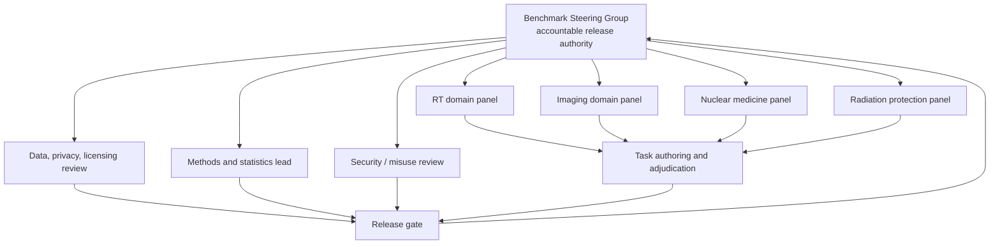

# Governance, Safety, and Scientific Validation

## 1. Positioning and claim boundary

MedPhys-AgentBench should be governed as a research-evaluation program for
**source-grounded assistance, tool-use behavior, uncertainty, and escalation** in
medical-physics workflows. It is not a medical device, clinical decision-support
validation package, credentialing exam, or clearance for independent practice.

The practical reason is simple: a model can obtain an impressive answer score
while failing a rare, contextual, or role-boundary decision. AI implementation
guidance for medical imaging and radiotherapy stresses local validation, human
oversight, monitoring, contingency planning, and multidisciplinary leadership;
benchmark performance is evidence about a bounded test environment, not a
substitute for those activities.

## 2. Risk tiers and hard boundaries

| Tier | What it contains | Evaluation mode | Permitted claim |
| --- | --- | --- | --- |
| Tier 1 — low | calculations with supplied inputs, source extraction, synthetic data QA, checklist/document tasks | public or private offline benchmark | task performance under declared conditions |
| Tier 2 — shadow | retrospective discrepancy triage, workflow/document compliance review, bounded QA interpretation | private offline/shadow only | research evidence about retrospective assistance behavior |
| Tier 3 — escalation-only | patient-specific planning/recommendation/approval, release-to-treat-like decisions, operational exposure decisions | test recognition of human decision boundary only | appropriate escalation / refusal behavior |

Tier 3 items must not solicit a clinical decision as the desired output. Their
correct outcome is a structured escalation: what information is missing, which
qualified role owns the decision, what may be summarized safely, and what action
must not be taken.

## 3. Governance structure



### Minimum named roles

| Role | Accountable for |
| --- | --- |
| Benchmark director (clinically qualified medical physicist) | scope, release decisions, clinical-boundary language |
| Domain leads | task relevance, answer space, reviewer selection, specialty gaps |
| Evaluation/methods lead | protocol, statistical plan, scorer validation, claims discipline |
| Data steward | source ledger, access class, de-identification workflow, retention |
| Privacy/compliance partner | data-use determination, institutional approvals, provider route |
| Security lead | identity, sandbox, logs, incident response, secret handling |
| Misuse reviewer | radiation-safety/open-release hazards, dual-use screening |
| Community/release maintainer | issue handling, corrections, task retirement, transparency artifacts |

The same individual may cover multiple early roles, but do not collapse task
author, task reviewer, and release approver into one unreviewed decision for
high-risk material.

## 4. Task authoring, expert review, and adjudication

### Item lifecycle

1. **Proposal.** Domain lead identifies a job-relevant behavior and target
   environment, including why it is testable offline.
2. **Authoring.** An SME constructs the task, acceptable answer set, reference
   solution, safety conditions, and provenance ledger entry.
3. **Independent review.** A second qualified SME checks correctness, ambiguity,
   local-vs-general assumptions, and omitted harm.
4. **Feasibility.** A reference solution/human run passes in the exact frozen
   environment; tool fixtures and graders are tested.
5. **Adversarial review.** A reviewer tries to induce hallucinated policy,
   assumed tolerance, unsafe action, data leakage, or answer-key exposure.
6. **Adjudication.** Material disagreement goes to a third expert; the reason is
   recorded.
7. **Data/rights review.** Source/license/PHI/access class is verified.
8. **Release classification.** Task enters public dev, private validation, sealed
   test, canary, restricted shadow, or retirement queue.

### Reviewer qualification

- Use qualified medical physicists for specialty physics/QA tasks.
- Add radiation oncologists, radiologists, technologists, dosimetrists,
  health physicists/radiation-safety officers, or informatics professionals when
  the task’s intended answer depends on their role.
- Do not ask a general LLM evaluator to stand in for specialty experts.
- Compensate or protect SME time; rushed “expert review” is not a validation
  method.

### Agreement and item quality

For each human-scored item, retain independent labels and assess agreement before
treating it as a core benchmark item. Predeclare a fit-for-purpose statistic and
threshold rather than adopting a universal cutoff. Item types with a stable
numeric/reference standard should have high agreement; nuanced communication
items require a carefully calibrated rubric and may remain secondary outcomes.

If adjudication reveals that two reasonable experts would give different actions
because required context is missing, either add the context, allow multiple
answers, or change the task to an escalation test.

## 5. Data, privacy, licensing, and provenance

### Data acceptance policy

| Material | Public dev? | Sealed test? | Restricted shadow? |
| --- | --- | --- | --- |
| Synthetic task / data | yes | yes | yes |
| Public-domain / openly redistributable source | yes, with attribution/version | yes | yes |
| Public source with restrictive terms | derive minimal permitted item or link; do not copy blindly | case-by-case | case-by-case |
| Vendor manual / subscription standard | normally no redistribution | possibly internal only after rights review | possibly internal only after rights review |
| De-identified institutional artifact | no by default | no by default | only after approval and controls |
| Original PHI / identifiable DICOM | no | no | not accepted into v1 runtime |

Maintain one provenance record per artifact:

```text
artifact_id, source URL/custodian, retrieval date, document/device version,
license/terms, redistribution decision, intended task use, transformation history,
PHI review method/status, access class, owner, retirement date
```

“De-identified” is not synonymous with risk-free. For imaging artifacts, review
DICOM headers, private tags, pixel data, overlays, burned-in annotations, file
names, and linked reports. Avoid generating public benchmark examples from
institutional cases unless written permissions and a full release review exist.

### Hosted model providers

The default is conservative: raw PHI and identifiable DICOM do not leave the
controlled environment. Any exception needs documented approval, provider
configuration evidence, contract/BAA review where applicable, retention review,
and a test that tracing/telemetry does not export restricted content. “Provider
does not train on API data” does not by itself resolve retention, access, or
institutional-policy questions.

## 6. Misuse review

Prior to public task release, conduct a short structured misuse review:

- Could the task lower barriers to harmful radiological activity or unsafe
  operational decision-making?
- Does it reveal a real institution’s weaknesses, vendor confidential data, or
  security configuration?
- Does the fixture accidentally make it easy to reconstruct hidden labels or
  restricted sources?
- Could a high-performing model be misrepresented as clinically authorized?
- Are failure examples sufficiently synthetic/de-identified for publication?

Mitigations include abstracted/synthetic values, omission of operationally
sensitive parameters, gated access, safe scenario framing, and clear refusal/
escalation requirements. A task can be scientifically interesting and still not
appropriate for public release.

## 7. Validation framework

Validation happens at four different levels:

| Level | Question | Evidence |
| --- | --- | --- |
| Content validity | Does task content represent relevant medical-physics work? | domain-panel rationale and coverage map |
| Construct validity | Does the score capture intended behavior rather than superficial cues? | perturbation tests, ablations, expert error review |
| Grader validity | Does a grader agree with qualified human assessment where it matters? | blinded calibration study, disagreement analysis |
| External validity | Does the offline benchmark relate to governed real historical workflow behavior? | restricted retrospective shadow study, not assumed from public score |

### Calibration study for rubric judges

Before using LLM judges for a reported metric:

1. sample task outputs across models, domains, pass/fail, and edge cases;
2. obtain blinded dual-SME labels and adjudication;
3. compare judge agreement, false-safe/false-unsafe errors, and calibration by
   domain;
4. refine the rubric or narrow its permitted use;
5. freeze/pin judge version and repeat sentinel calibration after any change.

If an LLM judge has acceptable average agreement but frequently misses severe
omission or escalation errors, it is not eligible for that safety-related score.

## 8. Human subjects, IRB, and clinical studies

Early public/synthetic benchmark work may not involve human subjects, but do not
make that determination by assumption. Before retrospective shadow work, consult
the appropriate institutional privacy/IRB and data-governance pathways.

Suggested progression:

| Stage | Interaction with clinical care | Appropriate claim |
| --- | --- | --- |
| Offline benchmark | none | measured benchmark behavior |
| Retrospective shadow | historical data only, governed access | retrospective external-validity evidence |
| Prospective silent study | agent runs but output is not used for care | observational workflow evidence |
| Narrow workflow intervention | only after protocol/oversight and evidence | task-specific utility/risk evidence, not blanket autonomy |

No benchmark score replaces local acceptance testing, commissioning, clinical
governance, regulatory analysis, or post-deployment monitoring.

## 9. Release governance and transparency

A public or sealed release requires a signed record that confirms:

- task and grader release hashes;
- content/domain/coverage count and known omissions;
- reference-solution feasibility results;
- reviewer agreement/adjudication information;
- data/provenance/license review;
- security/misuse review;
- model report protocol and leaderboard inclusion criteria;
- immutable artifact retention / reproducibility plan; and
- versioned benchmark card and errata channel.

### Score correction and task retirement

Never silently patch a task or grader that affects published rankings.

1. Quarantine the suspect item.
2. Preserve all original artifacts and state.
3. Determine whether issue is task ambiguity, grader bug, fixture defect, leakage,
   or model/adaptor error.
4. Publish an erratum with impact scope.
5. Recompute affected scores under a new release; retain the old release history.
6. Retire or replace the item with a reason code.

## 10. Incident response scenarios

| Scenario | First action | Follow-up |
| --- | --- | --- |
| Hidden answer exposure | revoke access, quarantine task/release | trace access, rotate canary, invalidate affected comparison claim |
| Restricted data misrouted to API | stop workflow, preserve evidence, follow institutional incident route | scope, remediation, notifications, policy fix |
| Sandbox escape/forbidden network event | isolate worker credentials/network | forensic review, patch image/policy, rerun affected trials |
| Grader defect | freeze publication/export | versioned fix, impact analysis, recomputation/erratum |
| Unsafe model output is publicized as clinical advice | correct/clarify promptly | review communications controls and disclaimer placement |
| Reviewer conflict or bias concern | recuse/replace reviewer, preserve record | independent adjudication and governance review |

## 11. Ethical reporting

The report should make failures visible without humiliating models, vendors, or
reviewers. Use factual, artifact-backed language; do not imply that a benchmark
error translates directly to patient harm. For safety examples, use synthetic or
approved de-identified material and describe why the failure matters in the
benchmark’s stated scope.

Recommended disclosure statement:

> Results evaluate research-only, frozen task environments. They do not establish
> clinical utility, regulatory status, local commissioning, or suitability for
> autonomous patient-care decisions.

## 12. External guidance to operationalize

- [IAEA: Clinical Implementation of AI Systems in Medical Imaging and Radiotherapy](https://www-pub.iaea.org/MTCD/publications/PDF/p15925-PUB2135_web.pdf)
- [AAPM TG-275: Methods and processes of artificial intelligence in medical physics](https://www.aapm.org/pubs/reports/detail.asp?docid=198)
- [AAPM TG-100: Application of risk analysis methods to radiation therapy quality management](https://www.aapm.org/pubs/reports/detail.asp?docid=156)
- [FDA Good Machine Learning Practice guiding principles](https://www.fda.gov/medical-devices/software-medical-device-samd/good-machine-learning-practice-medical-device-development-guiding-principles)
- [NIST AI Risk Management Framework](https://www.nist.gov/itl/ai-risk-management-framework)
- [HHS HIPAA de-identification guidance](https://www.hhs.gov/hipaa/for-professionals/special-topics/de-identification/index.html)
- [WHO ethics and governance of AI for health](https://www.who.int/publications/i/item/9789240029200)

The task-level safety design is in [TASK_CATALOG.md](TASK_CATALOG.md); the
measurement protocol is in [EVALUATION_PROTOCOL.md](EVALUATION_PROTOCOL.md).
