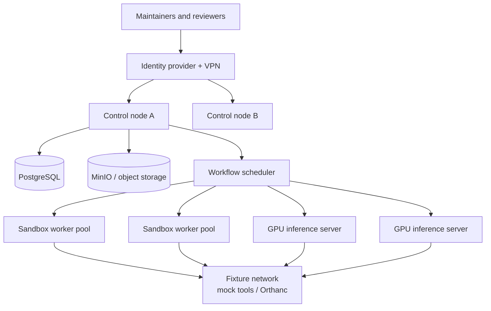

# Hardware, Deployment, and Operations Plan

## 1. Deployment strategy

Use a **local-first, cloud-burst** architecture:

- Keep public synthetic development work portable: laptop/workstation or ordinary
  cloud CI is enough.
- Keep private task banks, restricted shadow fixtures, raw traces, and local
  model inference within a controlled institutional environment by default.
- Use cloud capacity for de-identified/public workloads and short-lived model
  comparison bursts only after the data/provider route is formally approved.

This approach separates three needs that are often confused: running the harness,
serving a local model, and processing governed health data. The harness itself is
lightweight; repeated agent evaluation, sandboxing, artifacts, and local
inference create the real infrastructure demand.

## 2. Capacity tiers

### Tier A — developer / protocol-design machine

Use this while authoring synthetic tasks and building the core harness.

| Resource | Recommended floor | Why |
| --- | --- | --- |
| CPU | modern 8–16 core desktop/laptop CPU | local CI, fixtures, small concurrent sandboxes |
| RAM | 32–64 GB | DICOM fixtures, local services, browser/review development |
| GPU | none if using approved APIs; 16–24 GB useful for small local experiments | not a requirement for scaffold work |
| Storage | 1–2 TB NVMe | code, development artifacts, small fixture packs |
| Network | 1 GbE; 10 GbE helpful when using shared NAS | artifact sync |

This tier can run the current scaffold, contract tests, public fixtures, and an
API-only comparison workflow. It should not hold restricted data or pretend to
be a multi-user production platform.

### Tier B — single-workstation evaluation lab

This is the recommended first serious purchase if you want local open-model
comparisons and reproducible multi-tool tasks.

| Resource | Practical recommendation | Rationale |
| --- | --- | --- |
| CPU | Threadripper Pro / EPYC / Xeon class, 24–32 cores or more | supports concurrent sandbox workers, DICOM services, graders, and compression |
| RAM | 256 GB minimum; 512 GB preferred | avoids memory contention between local models, fixture services, and workers |
| GPU | 48 GB VRAM floor; 1–2 × 96 GB professional GPUs preferred for longevity | accommodates substantially larger local models and concurrent inference |
| Storage | 8–16 TB NVMe, preferably mirrored; separate backup target | traces and media fixtures grow quickly |
| Network | 10 GbE | fast artifact transfer to NAS/object store and future cluster |
| Power/cooling | workstation chassis, UPS, monitored airflow | long eval batches should not fail silently |

Current examples include the NVIDIA RTX 6000 Ada (48 GB) and RTX PRO 6000
Blackwell Workstation Edition (96 GB); choose after validating actual model
memory/concurrency needs and driver/library compatibility. The RTX PRO 6000
Blackwell datasheet lists 96 GB GDDR7, PCIe Gen 5, and a 600 W board requirement,
which has real implications for chassis, PSU, cooling, and circuit capacity.

Do not treat one GPU’s advertised “model size” as a capacity promise. Context
length, quantization, KV cache, tool concurrency, and model server overhead can
dominate the memory budget. Pilot actual chosen models with target context and
concurrency before buying more hardware.

### Tier C — secure internal lab

Use when multiple contributors, private holdouts, persistent review, or
restricted shadow evaluation justify operational separation.



Recommended starting shape:

| Layer | Initial count | Suggested capacity | Role |
| --- | ---: | --- | --- |
| Control nodes | 2 | 16–32 CPU cores, 64–128 GB RAM, redundant boot/storage | API, workflow, identity integration, observability |
| Sandbox workers | 2–4 | 32–64 cores, 128–256 GB RAM, fast local NVMe | high-density isolated task attempts |
| GPU inference servers | 1–2 | 512 GB–1 TB RAM, 1–4 GPUs, 8–16 TB NVMe | local model serving / embeddings / judge experiments |
| Object storage | 1 logical cluster | 50–200 TB usable, encryption, immutable release bucket | traces, replay bundles, fixtures, reports |
| Backup | separate system/account/site | immutable copies plus restore drills | ransomware and accidental-deletion recovery |
| Network | 25 GbE east-west baseline | separate management, control, sandbox, restricted-data segments | keeps artifact/service traffic out of user VLAN |

Move to 100 GbE only when multi-GPU interconnect patterns, many GPU servers, or
heavy multimedia artifacts justify it. Network isolation and availability matter
more than raw bandwidth in the initial lab.

### Tier D — public leaderboard / burst capacity

Keep the sealed task bank and release authority in a private control plane. A
public submission creates a queued immutable run request; an ephemeral worker
receives the runtime projection only and writes artifacts to a scoped location.

- Autoscale sandbox workers, not the hidden-label/grader tier.
- Use queue limits, per-submission budgets, abuse detection, and rate limiting.
- Use GPU cloud bursts for public/de-identified runs; do not make “cloud” a
  shorthand for approved handling of restricted health data.
- Separate public development data, managed submission artifacts, and internal
  evaluation data into distinct accounts/projects/keys.

## 3. GPU and local-inference strategy

### Decision table

| Need | Recommended path |
| --- | --- |
| Evaluate API models on public/synthetic tasks | no local GPU required; focus on policy, reproducibility, and spend controls |
| Run small open models / embedding / parser tools | one 24–48 GB GPU can be sufficient |
| Compare medium/large open models with realistic agent contexts | 48–96 GB VRAM; 96 GB is the more comfortable local target |
| Run high-concurrency or very large models locally | multi-GPU server or cluster; validate tensor-parallel compatibility and network topology |
| Handle restricted fixtures | local approved inference route by default; cloud use needs documented approval/contract |

Serve local models behind an OpenAI-compatible API (for example, vLLM) so the
same adapter can evaluate hosted and local endpoints. Record model repository,
weights commit/hash where possible, tokenizer, quantization, serving engine,
CUDA/driver version, tensor parallelism, context window, and batching settings.

The NVIDIA DGX Spark is an interesting compact prototyping option for ARM-based
local experimentation; NVIDIA documents 128 GB unified memory and 10 GbE/
ConnectX-7 options. It is not a substitute for a conventional x86 server without
first checking your image, Python, driver, and DICOM/tool dependencies on ARM.

## 4. Storage architecture and lifecycle

### Storage classes

| Class | Contents | Performance / durability target | Retention |
| --- | --- | --- | --- |
| Hot ephemeral | per-attempt scratch, live logs | local NVMe; destroyed at attempt end | hours/days |
| Warm artifacts | raw allowed output, normalized trace, grader evidence, screenshots | object store + lifecycle rules | benchmark-defined |
| Immutable release | task release manifests, final reports, selected replay bundles | WORM/Object Lock-style controls + offsite copy | long-term / policy-driven |
| Restricted | approved shadow data and derived artifacts | separate encrypted tenant/bucket, stricter RBAC | minimal necessary |
| Backups | encrypted immutable backups, key/config copies | separate account/site | 3-2-1 policy |

Keep a content digest for every input, output, image, and grader. Use a manifest
that tells you which artifact set supports each score. Test restore monthly; an
unrestored backup is only a theory.

### Artifact-growth budgeting

Measure before setting a long retention policy. Common drivers are:

- number of tasks × repeated trials × models;
- raw transcripts, tool logs, screenshots/video, DICOM derivatives, and replay
  bundles;
- trace sampling and LLM-judge artifacts;
- human-review packet copies;
- restricted data duplicated across controlled environments; and
- forensic/errata retention for published scores.

Start with sampled high-volume artifacts (for example, keep screenshots only on
failed/flagged attempts where safe) but never sample away the exact evidence
needed to reproduce a published outcome.

## 5. Network, identity, and secrets

### Network zones

```text
User / reviewer zone
        │ VPN + SSO + MFA
Control zone (API, scheduler, DB proxy)
        │ mTLS + allowlisted service identities
Sandbox zone (egress denied by default)
        │ task-scoped mock-tool links only
Fixture zone (Orthanc, mock APIs, frozen source service)
        │
Restricted zone (optional; separate tenant and keys)
```

- Treat the sandbox zone as hostile: no direct database/object-store credentials,
  no host mounts, no corporate network routing, no metadata-service access.
- Use workload identity or short-lived scoped credentials, not static API keys in
  task configs.
- Use a secrets manager for provider keys, object-store credentials, and signing
  keys; rotate and audit access.
- Separate maintainer/admin access from human-review access and from benchmark
  runner access.
- Do not log secrets, raw PHI, full DICOM payloads, or provider authorization
  headers into tracing systems.

## 6. Sandbox isolation choices

| Stage | Isolation option | Suitable for | Caveat |
| --- | --- | --- | --- |
| Early MVP | rootless Docker/Podman with seccomp, no network, read-only mounts | trusted internal demo fixtures | not sufficient for arbitrary untrusted model-generated code at scale |
| Team-ready | Kubernetes Jobs + gVisor | higher-density isolated workers | requires cluster operational maturity |
| Highest isolation | Firecracker microVMs | untrusted execution or strong tenant boundaries | more infrastructure and image-management complexity |

Regardless of technology, enforce: read-only root filesystem; dropped Linux
capabilities; non-root user; pids/CPU/RAM/disk quotas; short-lived scoped
credentials; no privilege escalation; no Docker socket; no arbitrary host mounts;
egress-deny default; and destruction/attestation of the attempt workspace.

## 7. Deployment profiles included in this scaffold

The repository includes configuration outlines, not a production deployment:

| Profile | Purpose | Allowed data | What it enables |
| --- | --- | --- | --- |
| `development` | local task/harness iteration | synthetic/public only | test, lint, simple deterministic demo |
| `lab` | controlled internal pilot | public plus approved internal non-PHI fixtures | local services, staged sandboxing, private validation |
| `public` | future managed submissions | public/de-identified approved only | queued ephemeral workers, public reports |

The example Compose file starts only PostgreSQL and MinIO for local platform
development. It does not start a live model provider, a clinical service, or a
restricted-data workflow.

## 8. Operational discipline

### Laptop memory guard

The default development profile is deliberately serial. It never runs fixture
construction, a browser build, and local inference concurrently. Ollama is
limited to one loaded model and one parallel request, then unloaded between
campaigns. Image/Parquet fixture construction streams one record batch at a time,
uses memory mapping, and enforces an RSS ceiling. New work stops below 30% free
system memory. The full-resolution cohort and Monte Carlo profiles are disabled
on a 24–32 GB laptop and routed to the lab profile.

Managed benchmark sweeps express these limits in a versioned campaign manifest.
`run-campaign` fails closed when available memory cannot be measured, blocks new
model work below both the fractional and absolute memory floors, checks free disk,
starts each model in a fresh serial child process, and rechecks the same frozen
floors before every missing attempt. A bounded, manifest-declared recovery wait
allows `keep_alive=0` model unloading to finish without weakening those floors.
A between-attempt breach is recorded as
non-scoring resource-block evidence and leaves the attempt key resumable. The committed Groq campaign
uses a 30% and 4 GiB memory floor plus a 10 GiB disk floor; local Ollama campaigns
must additionally declare `keep_alive=0` and a bounded context window.

### SLOs and monitoring

Track at least:

- queue delay, attempt-start latency, sandbox provisioning failure rate;
- provider/model timeout and retry rates by adapter;
- output validation, forbidden-tool, and critical safety failure rate;
- artifact write/read errors, task/grader version mismatch, and replay success;
- GPU memory utilization, model-server queue, CPU/RAM/disk pressure;
- cost per attempted/safe-successful task; and
- human-review queue age, disagreement rate, and reviewer workload.

Alert on sudden shifts by harness/model/task release. A score drift can be an
adapter, provider, fixture, evaluator, or real model change; preserve evidence
before diagnosing it.

### Backup and incident drills

Before restricted data or external users:

1. restore a task release, artifact bundle, and results database into an isolated
   environment;
2. simulate revoked provider credential / compromised worker identity;
3. simulate hidden-label exposure and task-leak quarantine;
4. simulate corrupted fixture / incorrect grader release;
5. verify public report correction and score-deprecation workflow.

## 9. Procurement questions to answer before spending

- Which models and context lengths will actually be run locally, at what
  concurrent attempt count?
- Will raw traces or DICOM fixtures be restricted, and where are approved compute
  and storage boundaries?
- Which environments need 24/7 uptime versus queued batch work?
- Can existing institutional storage, SSO, monitoring, and backup platforms be
  used without weakening isolation?
- Is reviewer time the bottleneck? If so, buy task-authoring/adjudication capacity
  before overbuying GPUs.
- What is the expected artifact retention and legal/IRB disposition policy?
- Can the selected GPU/CPU platform run the required container images and DICOM
  tooling? Validate on a pilot before standardizing.

## 10. Selected current vendor/technical references

- [NVIDIA RTX PRO 6000 Blackwell Workstation Edition datasheet](https://www.nvidia.com/content/dam/en-zz/Solutions/data-center/rtx-pro-6000-blackwell-workstation-edition/workstation-blackwell-rtx-pro-6000-workstation-edition-nvidia-us-3519208-web.pdf)
- [NVIDIA DGX Spark hardware guide](https://docs.nvidia.com/dgx/dgx-spark/hardware.html)
- [vLLM OpenAI-compatible serving](https://docs.vllm.ai/en/latest/serving/online_serving/openai_compatible_server/)
- [Firecracker microVMs](https://firecracker-microvm.github.io/)
- [gVisor production guidance](https://gvisor.dev/docs/user_guide/production/)
- [S3 Object Lock](https://docs.aws.amazon.com/AmazonS3/latest/userguide/object-lock.html)

Exact price and availability change frequently, so this plan deliberately gives
capacity ranges and compatibility criteria rather than a time-sensitive quote.
