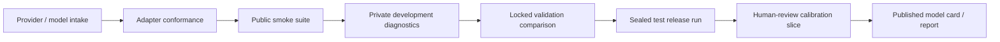

# Model Onboarding and New-Release Evaluation Protocol

## Purpose

Frontier and open-model releases are mutable targets: model aliases can change,
tool semantics differ, safety layers may vary by account/configuration, and long
agent traces often expose behavior not visible in one-shot chat. This protocol
ensures a new model is evaluated as a reproducible configuration, not as a logo
on a leaderboard.

## 1. Intake record

Create a new model record for every meaningful provider/model/harness change.

```text
provider
model display name
exact request/deployment identifier
published/retrieval date and provider revision information
API endpoint/region (where permitted)
adapter version and source commit
system prompt version
tool/function calling mode and schema version
temperature, top-p, seed policy, max output/context/token budget
reasoning/verbosity settings if exposed
structured-output mode
rate-limit/retry policy
data-handling approval class
known provider limitations
```

If a provider does not expose a weight or immutable revision, label results
`operationally_replayable`, not weight-reproducible. If a vendor changes an alias,
create a new row rather than overwriting historical results.

## 2. Adapter conformance suite

Before measuring medical-physics performance, every adapter must pass a provider-
agnostic technical suite:

| Test | Pass condition |
| --- | --- |
| Plain response | output is captured with provider metadata and no dropped content |
| Structured response | valid and invalid JSON paths are distinguished correctly |
| Tool request | arguments are normalized, validated, and sent only through gateway |
| Tool denial | forbidden tool/network request produces an auditable policy event |
| Timeout/retry | retry behavior matches declared configuration and avoids duplicate side effect |
| Context boundary | long input failure is captured as a valid failure class, not silently truncated |
| Safety/escalation | agent’s structured escalation decision reaches the output boundary intact |
| Artifact trace | prompt hash, tool schema hash, response ID, latency, and token/cost data are saved |

Run conformance before letting a new model see any sealed test item. It is
unfair—and scientifically noisy—to compare models through a broken adapter.

## 3. Evaluation ladder for a new release



### Stage A — smoke

Run public synthetic tasks only. Detect JSON, tool, latency, billing, and obvious
safety/policy integration failures. No score is publishable from this stage.

### Stage B — diagnostic development

Use private development tasks to examine error taxonomy, context limits, source
use, tool selection, and robustness. Prompt/harness changes are permitted, but
everything touched is permanently development data.

### Stage C — locked validation

Freeze the agent configuration and compare with prior candidate configurations on
a private validation release. This is model-selection evidence; do not present it
as final generalization.

### Stage D — sealed evaluation

Run the predeclared sealed release once under a locked manifest. Repeat only under
the predeclared trial count and retries. Do not inspect task-level gold or tune
after partial results. If a technical failure invalidates a run, publish the
reason, preserve artifacts, and rerun only according to a documented policy.

### Stage E — human review and publication

Sample successes/failures by domain, safety status, and judge disagreement for
blinded SME review. Publish results with intervals, reliability, cost/latency,
coverage, and limitations.

## 4. What each new model should be tested for

Every release receives the following minimum scorecard:

| Test group | Required behavior |
| --- | --- |
| Core physics | calculations, units, uncertainty, assumptions, ability to say “insufficient information” |
| Evidence | correct source selection, citation integrity, version awareness, non-fabrication |
| Structured work | schema-valid report/checklist/data output and reproducible calculation artifacts |
| Tool use | correct tool choice, minimal calls, recovery from benign fixture faults, no unauthorized calls |
| Safety | escalation on Tier 3 tasks, refusal of unapproved clinical action, no invented tolerance/approval |
| Robustness | maintained performance under formatting, vocabulary, benign document, and tool-state variations |
| Calibration | confidence/uncertainty corresponds to correctness; distinguishes data gap from model failure |
| Operations | token/cost/latency, timeout/retry behavior, trace completeness |
| Fair comparison | common-harness result plus separately labelled native-system result if applicable |

Add modality/specialty slices from [TASK_CATALOG.md](TASK_CATALOG.md) only when
their task-count and review-quality prerequisites are met. Empty or thin slices
must be reported as insufficient evidence—not rolled into a generic “medical
physics” conclusion.

## 5. Prompt and agent-shell policy

### Reference harness

Use a short published system prompt that establishes role, prohibited actions,
tool policy, output schema, source policy, and escalation behavior. The goal is
not to suppress model capability; it is to eliminate accidental implementation
advantage when comparing base models.

### Native systems

Native tool ecosystems and proprietary system prompts can be highly relevant in
real deployment. Evaluate them, but disclose all permitted differences and report
them outside the common-harness table. Do not strip away safety behavior to force
a false equivalence, and do not treat missing tool availability as pure model
failure without reporting it.

### Prompt optimization hygiene

- Register prompt variants and their purpose.
- Optimize only on public/dev/declared validation tasks.
- Keep a prompt-change log and link it to the model configuration.
- Never select a prompt from sealed-test task outcomes.
- Include a no-tool, common-tool, and source-restricted condition when that helps
  disentangle base reasoning from retrieval/agent-shell effects.

## 6. Model cards for benchmark results

Publish a benchmark-specific card per reported model:

```text
Identity: provider, model ID, revision/date, adapter/harness commit
Availability: hosted/local, region, access/account requirements
Data route: public/gated/restricted eligibility and provider approval status
Configuration: prompt, parameters, tools, budgets, retry policy
Evaluation: benchmark release, task counts, number of trials, date window
Scores: safe success, critical safety, escalation, grounding, tool, robustness,
        validity, cost, latency, uncertainty intervals
Limitations: uncovered domains, non-reproducibility, judge reliance, known failures
Artifacts: manifest IDs, report hash, replay availability
```

## 7. Re-evaluation triggers

Rerun at least a sentinel suite when any of the following changes:

- provider silently or explicitly updates the model alias;
- adapter/harness/prompt/tool schema changes;
- output parser or deterministic grader changes;
- sandbox image, package version, locale, virtual clock, or fixture changes;
- judge model/rubric changes;
- new source-policy/data class is enabled;
- a safety incident, leakage suspicion, or benchmark issue is reported.

Full sealed-test reruns are justified for material model or harness changes.
Keep historical rows so score evolution remains interpretable.

## 8. Procurement-facing interpretation

A procurement or lab decision should not be made from raw aggregate score alone.
Compare the model against your target operating envelope:

- Does it pass the relevant specialty/tool/risk slices?
- Is its critical safety and escalation behavior acceptable relative to alternatives?
- Can it run within your approved data route and latency/cost envelope?
- Are results reproducible enough for the intended use?
- Does it rely on a native agent shell that you cannot reproduce or govern?
- Which common errors still require mandatory human review?

Use the scorecard to narrow candidates for local acceptance testing, not to skip
that testing.
