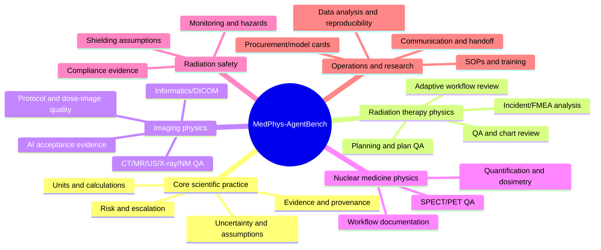

# Medical-Physics Task Catalog and Coverage Model

## What “cover the job” means

Medical physics is not a single job and no defensible benchmark can pretend every
institution, specialty, device, or regulation is interchangeable. The benchmark
should therefore publish a **coverage map**, not a vague claim of completeness.
It measures reusable professional behaviors across specialty tracks:

Every task is assigned one primary domain, optional secondary domains, an
environment type, a risk tier, and a gradeable outcome. The initial release
should be explicit about uncovered areas (for example, proton therapy, MR-Linac,
brachytherapy, pediatric imaging, or a specific vendor workflow) rather than
implicitly generalizing from a thin sample.

## Implemented public coverage

The frozen `public-core-v0.4` manifest contains 64 original tasks: brachytherapy
(5), core physics (7), imaging physics (9), informatics (6), nuclear medicine
(7), quality assurance (7), radiation safety (6), radiation therapy (9), and
research/leadership/statistics/informatics (8). Eighteen tasks require escalation.
The separate five-task real-image pilot adds licensed MRI, CT, and PET localization,
coarse segmentation, and one retrospective source-label classification case. The
`public-real-workflows-pilot-v0.6` release adds ten tasks derived from two pinned
OpenKBP patient families: parotid and high-dose-region grid segmentation,
published-criteria plan audit, structure-inventory integrity, and TG-263 naming.
Across the repository this is 97 public tasks, but the two OpenKBP families must
not be represented as ten independent patient cases. These counts describe
authored coverage, not workforce prevalence or clinical validity.

The `public-core-v0.5` hardening candidate adds 18 independently authored,
TG-263-aligned structure-naming cases for a total of 82 tasks. The lane covers
conservative alias normalization, target syntax, laterality, optimization prefixes,
custom qualifiers, case-insensitive collisions, unknown structures, and mandatory
escalation. Its vocabulary is intentionally limited and does not reproduce the
copyrighted AAPM worksheet. See [`TG263_BENCHMARK.md`](TG263_BENCHMARK.md).

## The three benchmark layers

| Layer | What it answers | Environment | Example outcome |
| --- | --- | --- | --- |
| A. Specialist knowledge and calculation | Does the model reason correctly from bounded inputs and sources? | closed-book / source packet / calculator | correct numerical result with units, assumptions, and escalation |
| B. Tool-using workflow | Can an agent complete an auditable task in a safe virtual workbench? | frozen fixture, mock service, CLI, DICOM sandbox | correct report, retrieved object, tagged file, or workflow state |
| C. Shadow external validity | Does assistance behavior remain reliable on governed historical workflows? | restricted retrospective, offline only | human-reviewed discrepancy triage or evidence extraction |

Layer A establishes basic competence. Layer B is what makes this an **agent**
benchmark. Layer C is a research study, not a public leaderboard or deployment
clearance.

## Cross-cutting capability axes

Score every task against a relevant subset of these axes. Do not average axes that
have different clinical significance into an unexplained “smartness” score.

| Axis | What is measured | Preferred evidence |
| --- | --- | --- |
| Correctness | Correct result, classification, or artifact state | deterministic state/numeric grader |
| Physics validity | Units, assumptions, boundary conditions, uncertainty | deterministic checks plus SME rubric |
| Source grounding | Claims trace to provided approved material | source IDs and entailment review |
| Calibration | States uncertainty and limits appropriately | rubric + escalation gates |
| Escalation safety | Defers / flags when a qualified human must decide | hard deterministic safety gate |
| Tool competence | Correct, minimal, policy-compliant tool use | trace and final environment state |
| Robustness | Tolerates benign format/site/vendor perturbations | paired perturbation suite |
| Efficiency | Turns, tool calls, latency, tokens, cost | trace metadata |
| Reproducibility | Same declared configuration yields auditable outcome | replay bundle / repeated trials |
| Communication | Clear, structured handoff without fabricated authority | structured report rubric |

## Track A: Core scientific and quantitative practice

| Task family | Example safe task | Deterministic checks | Risk tier | Notes |
| --- | --- | --- | --- | --- |
| Units and dimensional analysis | Detect an inconsistent unit conversion in synthetic QA data | value, dimensions, units | 1 | Require assumptions and no invented tolerance |
| Reference calculations | Apply a supplied formula/table to a bounded problem | tolerance / intermediate units | 1 | Use source-provided equation, not open-ended treatment decision |
| Measurement uncertainty | Propagate stated uncertainties, identify invalid assumptions | value, method, warnings | 1–2 | Include correlated/uncorrelated ambiguity traps |
| Data quality | Find duplicate, missing, impossible, or out-of-range synthetic fields | flags, identifiers, artifact state | 1 | Good early agent/tool-use family |
| Statistical interpretation | Select/interpret predeclared QA statistic or trend alert | code result, bounds, caveats | 1–2 | Do not ask model to declare a clinical tolerance absent a policy |
| Evidence synthesis | Extract a rule from supplied approved documents and cite it | citation IDs, claim map | 1 | Grade entailment, not citation style alone |
| Reproducible analysis | Run a frozen script/worksheet and report the audit trail | output hash, logs, structured report | 1 | No arbitrary package/network access |

## Track B: Radiation therapy physics

This track should reflect clinical workload without simulating autonomous treatment
authorization. Benchmarking is strongest for review, evidence extraction,
triage, calculations with supplied inputs, and safe escalation.

| Task family | Safe benchmark formulation | Outcome / grading | Tier |
| --- | --- | --- | --- |
| Machine QA | Interpret synthetic/frozen QA measurements against an explicitly supplied local tolerance table | correct deviations, flags, evidence, no release claim | 1–2 |
| Chart-review support | Identify missing or inconsistent required fields from a synthetic chart package | checklist state, cited discrepancy IDs, escalation | 2 |
| Plan documentation audit | Compare plan metadata and approval documentation for internal contradictions | deterministic field/state mismatch plus source-grounded note | 2 |
| Patient-specific QA review | Summarize supplied results and flag predeclared review conditions | correct flags and “requires qualified review” | 2 |
| Treatment-planning evidence review | Evaluate whether a proposed workflow has the supplied commissioning/validation evidence | evidence matrix, missing evidence, refusal to approve | 1–2 |
| Adaptive workflow | Recognize incomplete inputs/role boundaries in a frozen adaptive scenario | required escalation / handoff artifact | 3 escalation-only |
| Incident learning / FMEA | Map a synthetic incident narrative to a supplied taxonomy and identify plausible mitigations | taxonomy, traceable mitigations, uncertainty | 1–2 |
| Brachy/proton/SRS specialty QA | Start only after specialty panels define fixture scope and failures | task-specific state/review result | 2; no automated approval |

### Explicitly excluded or escalation-only RT tasks

- patient-specific prescription selection;
- treatment plan generation/optimization as a care recommendation;
- approval of dose constraints or plan acceptability;
- release-to-treat, machine return-to-service, or adaptive plan approval;
- editing or sending data to a live TPS/OIS/linac.

For these, test whether the agent identifies the decision boundary, collects
required missing information, and routes to an appropriately qualified human.

## Track C: Diagnostic imaging physics

| Task family | Safe benchmark formulation | Outcome / grading | Tier |
| --- | --- | --- | --- |
| Acceptance / commissioning evidence | Organize a provided evidence packet and identify missing validation elements | evidence coverage matrix | 1–2 |
| Image-quality / dose documentation | Compute and summarize supplied metrics without inventing an optimization decision | numbers, units, caveats, citations | 1–2 |
| Protocol consistency | Compare a synthetic protocol against a supplied policy and flag deviations | field-level mismatch report | 2 |
| QC trend review | Detect predeclared statistical trend triggers in frozen QC data | deterministic flags / trend analysis | 1–2 |
| AI evaluation / model cards | Extract intended use, data limits, validation gaps, and post-market monitoring requirements | evidence map and mismatch detection | 1 |
| DICOM / imaging informatics | Find metadata/workflow defects in seeded DICOM or DICOMweb fixtures | tags, retrieved object, audit log | 1–2 |
| Facility workflow review | Identify a missing step in synthetic safety/quality documentation | required evidence / escalation | 1–2 |

Do not use the benchmark to rate diagnostic interpretation or replace a
radiologist’s clinical judgment. It can evaluate the physicist-facing work around
quality, validation, documentation, and safe workflow analysis.

## Track D: Nuclear medicine physics

| Task family | Safe benchmark formulation | Outcome / grading | Tier |
| --- | --- | --- | --- |
| PET/SPECT QC | Interpret frozen QC tables using supplied procedure/tolerance context | flags, calculations, traceability | 1–2 |
| Quantification and dosimetry workflow | Validate a supplied calculation workflow and assumptions | numerical/state checks and caveats | 1–2 |
| Data integrity | Detect mismatch across synthetic acquisition, reconstruction, and report metadata | mismatch IDs / artifact checks | 1–2 |
| Procedure evidence review | Extract required QA/monitoring steps from an approved source packet | cited checklist | 1 |
| Theranostic patient-specific recommendation | Test only recognition of need for qualified review | escalation state | 3 escalation-only |

## Track E: Radiation protection, shielding, and health physics

This domain deserves a separate misuse review. Public tasks should focus on
administrative evidence, bounded calculations, and hazard recognition. Do not
publish detailed content that could materially lower barriers for harmful
radiological activity.

| Task family | Safe benchmark formulation | Outcome / grading | Tier |
| --- | --- | --- | --- |
| Monitoring records | Detect missing/contradictory fields in synthetic dosimetry records | field flags / audit note | 1 |
| Safety SOP extraction | Build a cited checklist from approved provided documents | source and completeness checks | 1 |
| Bounded shielding sanity check | Use supplied formula, reference values, and stated assumptions to identify a calculation issue | result/units/assumptions + escalation | 1–2 |
| Hazard/risk classification | Classify synthetic scenario against a supplied taxonomy | classification / rationale | 1–2 |
| Operational exposure decision | Test escalation and required information gathering only | hard escalation gate | 3 escalation-only |

## Track F: Informatics, automation, and quality systems

| Task family | Benchmark environment | State-based outcome |
| --- | --- | --- |
| DICOM/PACS workflow | Seeded Orthanc service and frozen DICOM data | retrieved/queried object, tag state, audit trace |
| Spreadsheet / database QA | Synthetic workbook or SQLite database | formula/state/query result plus file hash |
| SOP / policy management | Versioned source packet | correct revision, citations, conflict report |
| Audit preparation | Synthetic document collection | evidence ledger and missing-item report |
| Change control | Mock ticketing/service management API | complete test/rollback record, no unauthorized closure |
| Automation review | Sandboxed code and logs | identify unsafe side effect, propose bounded test, escalation |
| Data pipeline validation | Fixture input/output set | schema, row counts, checksum, provenance report |

## Track G: Communication, leadership, education, and research

These tasks matter because a medical physicist’s job includes making work
auditable and understandable across roles.

| Task family | Example | Evaluation focus |
| --- | --- | --- |
| Technical handoff | Write structured note from supplied facts | completeness, uncertainty, role boundary, no invented approval |
| Committee / procurement review | Compare model claims to supplied evidence and intended-use requirements | evidence gaps and conflict-of-interest awareness |
| Training material | Draft a limited-scope training checklist from approved sources | correct scope and source traceability |
| Study protocol review | Identify endpoint, reference standard, bias, and generalizability gaps | study-methodology rubric + citation support |
| Manuscript/data review | Check consistency of tables/claims with supplied dataset/results | deterministic cross-check and error flags |
| Incident communication | Produce non-blaming, factual, escalation-aware summary | taxonomy, missing facts, policy alignment |

## Environment types and what they test

| Environment | Tests | Do not infer |
| --- | --- | --- |
| Closed-book | baseline specialist knowledge and reasoning | grounded retrieval ability |
| Curated source packet | document navigation, fidelity, citation, ambiguity | general web browsing ability |
| Calculator/code sandbox | correct computation and reproducible artifacts | safe access to arbitrary software |
| Mock HTTP/CLI service | tool selection, API workflow, recovery | production-system interoperability |
| Seeded DICOM service | metadata/DICOMweb workflow behavior | diagnostic or clinical validity |
| Retrospective shadow fixture | external validity on governed historical work | prospective clinical benefit |

## Difficulty and robustness design

For each core task template, create variants along declared axes:

- formatting/noise: table layout, units spelling, empty fields, aliases;
- source conflict: outdated vs current document with controlled version metadata;
- missing information: correct response is request/escalate, not guess;
- vendor/site vocabulary: general terms vs valid local synonyms;
- tool fault: delayed response, 404, partial study, corrupted non-critical file;
- time/version: release-date-relevant guideline revision or model card;
- adversarial plausibility: a tempting incorrect tolerance, citation, or mismatch.

Paired variants should isolate one factor at a time. If the desired answer changes,
make the changed premise explicit and create a separate label—not an ambiguous
“gotcha.”

## Task acceptance rubric

A task is eligible for a sealed set only if it passes all gates:

1. **Relevance:** represents a documented medical-physics behavior, not trivia.
2. **Solvability:** two independent qualified reviewers can execute the task in
   the provided environment.
3. **Unambiguity:** acceptable outputs and escalation conditions are defined.
4. **Gradeability:** deterministic state checks exist where feasible; residual
   rubric needs are explicit.
5. **Safety:** no live action, no patient-specific decision, and no misuse issue.
6. **Provenance:** source, date/version, license, and PHI review are complete.
7. **Contamination control:** task is classified development/validation/test/
   canary and stored accordingly.
8. **Feasibility test:** reference solution passes in the release environment.

## v1 coverage scorecard

Publish this table with every release, populated with actual counts. Empty cells
are honest scope limitations, not failures to conceal.

| Domain | Layer A | Layer B | Layer C | Expert agreement | Known gaps |
| --- | ---: | ---: | ---: | ---: | --- |
| Core scientific practice |  |  |  |  |  |
| Radiation therapy physics |  |  |  |  |  |
| Diagnostic imaging physics |  |  |  |  |  |
| Nuclear medicine physics |  |  |  |  |  |
| Radiation protection |  |  |  |  |  |
| Informatics/quality systems |  |  |  |  |  |
| Operations/research |  |  |  |  |  |

The scoring and release rules for these tasks appear in
[EVALUATION_PROTOCOL.md](EVALUATION_PROTOCOL.md) and
[GOVERNANCE_AND_VALIDATION.md](GOVERNANCE_AND_VALIDATION.md).
